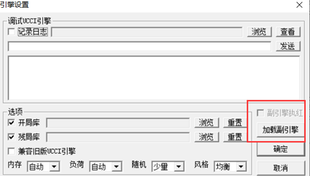
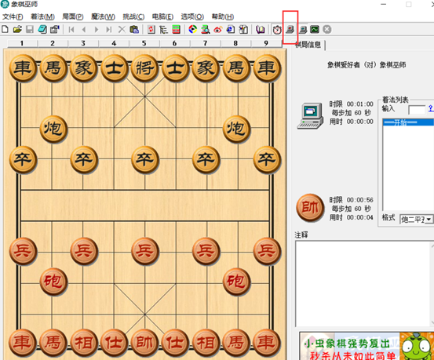
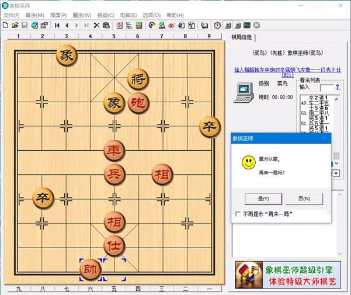

# Chinese-Chess-AI-Engine

## 项目背景

本项目是人工智能原理与技术实践课的课程设计，要求完成一个实现了UCCI通信协议的人工智能中国象棋程序。本项目的可执行程序可以加载到象棋巫师软件中，它的棋力能和象棋巫师的业余、专业级别激战。

## 使用技术

主要使用的算法与数据结构：

- 带alpha-beta剪枝的minimax搜索算法
- 主要变例搜索算法
- 历史启发、杀手启发
- 置换表
- 迭代加深搜索

## 编译运行方法

Visual Studio 2019可以直接编译运行。

## 效果演示

### 加载副引擎

在象棋巫师中加载副引擎，并按先后手设置副引擎是否执红。

### 开始对战

设置完毕后，将两个电脑都勾选（如图为副引擎执红的情况）

某一次胜利对战结果：

